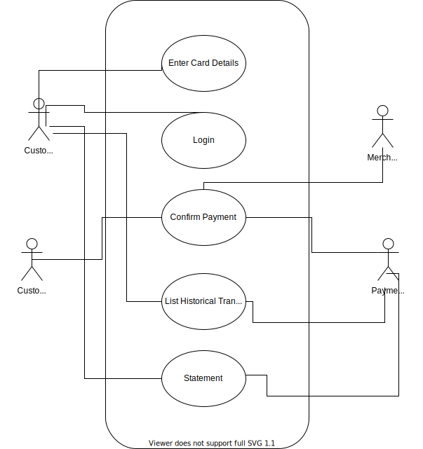

# Programming Methodology For Finance Project for  Fall 2021

**Project Name:**  B2C FOCUSED PAYMENTS

**Team No: 02**

**Team Members:**
1. Aditi Satish <fa402@scarletmail.rutgers.edu>
2. Kartik Modi <km1449@scarletmail.rutgers.edu>
3. Khyati Dinesh Patel <kp935@scarletmail.rutgers.edu>
4. Prachi Phatale <pp811@scarletmail.rutgers.edu>
5. Sudarshan Srinivasan <ss3020@scarletmail.rutgers.edu>

# Proposal

## Objective 
A project in the evolution of payment gateway from B2B business to B2C model. Creating a customer-centric payment gateway, which is exposed and marketed to the user. The payment gateway will offer REST-based APIs for integration with clients.

## Target Clients:
1. Small businesses are likely to use 3rd-party payment to sell products online.
2. Individuals who are looking to receive payments by selling products 1-2-1 like on Facebook marketplace.
3. Please post a link while asking for donations for the work they are doing.

## Goal
Goal Number | Goal |Feature  | Scope of Feature | Order of Execution | Module|    
|----| ----------- | ----------- | -------- |----------| -----|
1|Basic Functionality| Perform a transaction (Between user and the merchant) by specifying card details.| The user can initiate the fund transfer to the merchant by adding card details| 1|  Server-side/UI
2| Ease of Access| Saving card information from the transaction history| Asking the user to create an account, if the user wants to save card info. For future use. The information  user enters will be stored in the payment gateway’s database. By saving the card details, the user does not have to enter the card details for every transaction.|2|UI/Server/DB
3|Trust and Transparency|Get a complete view of how money flows through the transaction between the user and the merchant.|Money Flow with existing metadata stored in the database. The flow would NOT be within the server as we would contact the customer’s bank, intermediary bank, merchant’s bank.|3|UI / DB/ Server(very minimal)
4|Analytics|Show a pie chart grouped on the transaction type.|Categorize/tag transactions into categories like grocery, e-commerce, restaurants to help users understand their spending.|3|UI / DB/ Server(very minimal)
5|Ease of Access|Statement Download|Users should have options to download statements in pdf format requested on demand. We’ll take range as input from the user with maximum range upto 7 days.|3|Server/DB

## Actions Listing

## Resources Listing

1. Customer Information
   1. Name of User
   2. Email
   3. Username
   4. Password
   5. Phone Number
    
2. Card Information
   1. Card Type
   2. Card Number
   4. Card Expiration Date
   
3. Transaction History
    1. Transaction type
    2. Transaction status
    3. Transaction timestamp
    4. Merchant id
    5. Customer id

4. Live Transactions
      1. Transaction type
      2. Transaction status
      3. Transaction timestamp
      4. Merchant id
      5. Customer id

5. Statement
   1. Generated Timestamp
   2. Requested by
   3. Requested timestamp
   4. Status
