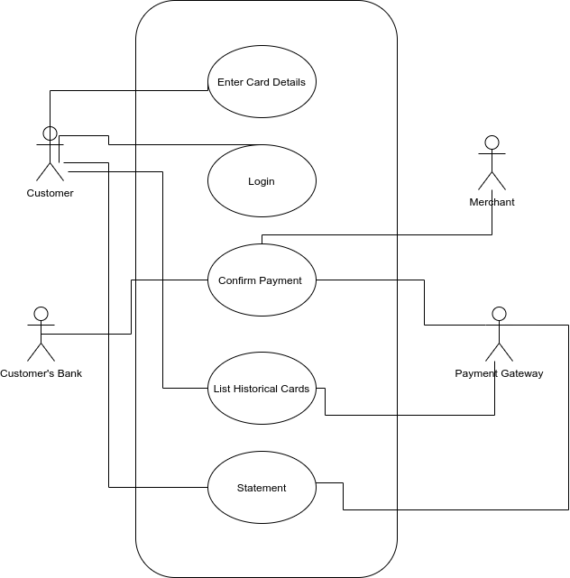

# Programming Methodology For Finance Project for  Fall 2021

**Project Name:**  B2C FOCUSED PAYMENTS

**Team No: 02**

**Team Members:**
1. Aditi Satish <fa402@scarletmail.rutgers.edu>
2. Kartik Modi <km1449@scarletmail.rutgers.edu>
3. Khyati Dinesh Patel <kp935@scarletmail.rutgers.edu>
4. Prachi Phatale <pp811@scarletmail.rutgers.edu>
5. Sudarshan Srinivasan <ss3020@scarletmail.rutgers.edu>

# Proposal

## Objective 
A project in the evolution of payment gateway from B2B business to B2C model. Creating a customer-centric payment gateway, which is exposed and marketed to the user. The payment gateway will offer REST-based APIs for integration with clients.

## Target Clients (Examples):
1. Small businesses are likely to use 3rd-party payment to sell products online.
2. Individuals who are looking to receive payments by selling products 1-2-1 like on Facebook marketplace. The individuals will use B2C payment gateway as a platform to receive payment. 
3. Non-profit organizations requesting donations for their work. The payment gateway will provide embedded web component as 1-click donation button. 

## Resources Listing - ( All are Collection of records - PERSISTENT)

1. Customer Information - The end customer's information. This will uniquely identify a customer which is doing the transaction.
   1. customer_uuid - This will act as a unique identifier for a end customer.
   2. Name of Customer
   3. Email
   4. Password
   5. Phone Number

2. Card Information - Saved card details will be fetched from here for a customer.
   1. Card Type
   2. Card Number
   3. Card Expiration Date
   4. customer_uuid

3. Transaction History
   1. Transaction type - CREDIT CARD/DEBIT CARD
   2. Transaction vendor - VISA/MasterCard
   3. Transaction status - SUCCESS/FAILURE/IN_PROGRESS
   4. Transaction timestamp
   5. Merchant_uuid
   6. customer_uuid
   7. category_uuid

4. Live Transactions
   1. Transaction type
   2. Transaction status
   3. Transaction timestamp
   4. Merchant id
   5. Customer id
   6. category_uuid

5. Statement
   1. Generated Timestamp
   2. Requested by
   3. Requested timestamp
   4. Status
   5. Timestamp range of statement

6. Merchant - A merchant is one who is receiving payments.
   1. merchant_uuid -  This will act as a unique identifier for the merchant.
   2. Merchant Name - Name of the merchant. eg. Amazon/Jacob Furniture/Logitech/COVID Relief Fund
   3. Merchant Type - Recognizing type through nature of business of merchant. eg. INDIVIDUAL/SMALL BUSINESS/ENTERPRISE/NON-PROFIT
   4. merchant bank - Merchnat's bank name. eg. WellsFargo/BOA
   5. merchant bank account number 

7. Transaction Category
   1. category_uuid - Identify a transaction category uniquely.
   2. Category_name - Categorizing merchants for analytics and business needs. eg. RESTAURANT/GROCERY/ECOMMERCE

## Goal
Goal Number | Goal |Feature  | Scope of Feature | Order of Execution | Module| Resources Used |   
|----| ----------- | ----------- | -------- |----------| -----|-----|
1|Basic Functionality| Perform a transaction (Between user and the merchant) by specifying card details.| The user can initiate the fund transfer to the merchant by adding card details| 1|  Server-side/UI|2. Card Information, 3. Transaction History, 4. Live Transactions|
2| Ease of Access| Saving card information from the historical transactions| Asking the user to create an account, if the user wants to save card info. For future use. The information  user enters will be stored in the payment gateway’s database. By saving the card details, the user does not have to enter the card details for every transaction.|2|UI/Server/DB| 1. Customer Information 2. Card Information|
3|Trust and Transparency|Get a complete view of how money flows through the transaction between the user and the merchant.|Money Flow is a UI widget getting populated with existing metadata stored in the database. The flow cannot be just within the server as we would contact the customer’s bank, intermediary bank, merchant’s bank. It will show a lineage in a widget containing transaction amount, customer's bank, intermediary bank, merchant bank. |3|UI / DB/ Server(very minimal)| 1. Customer Information, 2. Card Information, 6. Merchant
4|Real Time Analytics|Show a pie chart grouped on the transaction type.|Categorize/tag transactions into categories like grocery, e-commerce, restaurants to help users understand their spending.|3|UI / DB/ Server(very minimal)| 1. Customer Information, 7. Transaction Category, 3. Transaction History|
5|Ease of Access|Statement Download|Users should have options to download statements in pdf format requested on demand. We’ll take range as input from the user with maximum range upto 7 days.|3|Server/DB| 3. Transaction History, 5. Statement, 1. Customer Information|

## Actions Listing

# Professor's Comments:
1. Your "Target Clients" also include selling products online, but none of the resources mention sales or products...? 
> We are a pure payment gateway product. We don't store any details about business/organization data.  

2. None of your resources mentions donations as a resource or an attribute of a resource.
    Should these be somehow accounted for in your resource list?
    Please clarify.
> Accounted in Resources Listing

3. You are mentioning categories of transactions, like grocery, e-commerce, restaurants, ...
    I'm not sure if there should not be a separate resource with a list of categories of transactions...?
    After all, the categories may need to be changed over time?!? 
> Agreed. We have normalized the transaction into a separate resource, and mapped it to history and live transactions with category_uuid.

4. You are using the term "Money Flow", but it is not listed as a resource.
   What is it? -- Please clarify.
> Money is a UI Feature. It's a widget which will show customer's bank, merchant's bank, any intermediaries.
> THis is only to show transparency of a transaction.
> [#TODO] add diagram

5. I cannot see how this statement is reflected in your resource list.
   If something will be "stored in the database", then it must be explicitly shown in the list of resources.
> We have store statement information in point 5 of resources. The statement would be generated through Transaction History. 

6. I guess what you are trying to say is that your server will NOT store the information about transactions in a local database, but will create the transactions list dynamically, on demand, and destroy this information after it is presented to the client...?
   Is this true?
   If yes, make it explicit.
> No. We are going to persist transaction history, live transactions, customer's information in the database.
> Nothing will be destroyed as we may need data in future for auditing, compliance, analytics etc.

7. You left the list of Actions empty, but placed it before Resources.
   Because the Actions are on Resources, Actions should be listed after the Resources.
> There exist a diagram which show all the actions in the system. We commit the diagram in svg, to have vector image.
> We'll move it to a png based, to get better compatibility in browser.

8. Also make clear whether the results of these operations will be stored in your database.
> We'll not be storing pie-chart data, or any generated statement, because these are always re-creatable from existing table.

9. You already kind of indicated that the money flow will not be stored, but I'm not sure if this is what you wanted to say.
> Money flow is just a UI feature, which will be using data from transaction history, merchant. 
